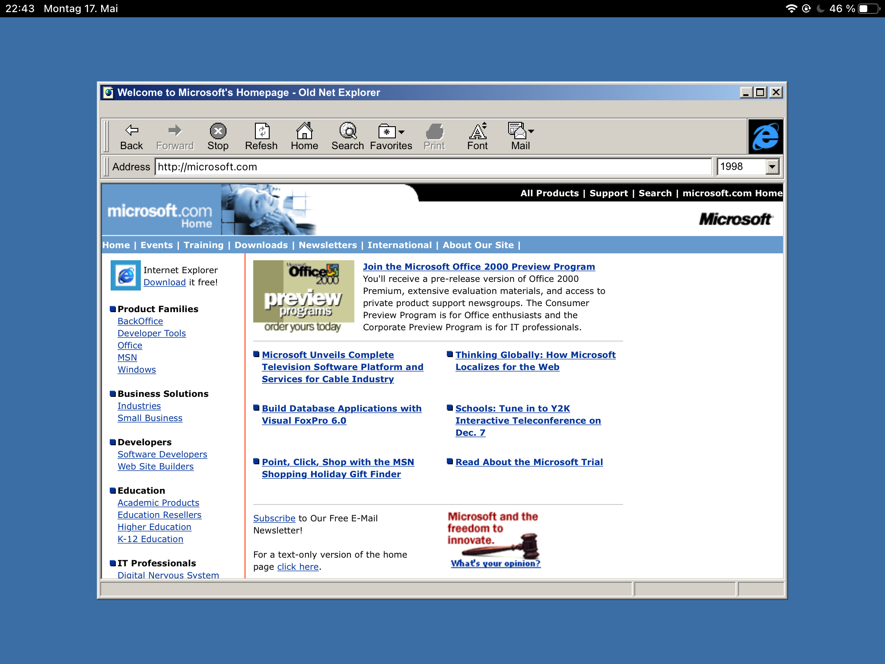

# Fake IE / The Old Net Explorer

This app uses the website [The Old Net](https://theoldnet.com) to let you browse the internet the way, it was, back when Internet Explorer was still "cool".

Currently this app is only optimized for the iPad in landscape mode, but might also run on other devices.



## State of the project

This project is something, I do as a hobby. As such, it is not feature complete yet or has the most amazing code.

At the moment, it supports basic web-surfing and selection of the year, in which you want to browse the web.

Favorites are not yet added but might come soon.

## Testing the app

This app was built using the [Expo](https://expo.io)-Framework. You can easily run the app by [installing the explo-cli](https://docs.expo.io/get-started/installation/) and running the project.

Basically running the app boils down to:

**On your PC:**

1. Install [node.js](https://nodejs.org/en/)
2. Install expo: `npm install --global expo-cli`
3. Go to the project directory and install the dependencies: `npm install`
4. Run expo using `expo start`
5. Expo will open a browser with a QR-Code

**On your iPad:**

1. Install the [Expo client](https://apps.apple.com/de/app/expo-client/id982107779)
2. Make sure that your PC and your iPad are on the same network
3. Scan the QR-Code with the iOS camera and open the included link

## Preview Features

The app supports the use of Windows-Colorschemes. To select a different color-scheme, find this line in `App.tsx`:

```ts
<ThemeProvider theme={schemes['Windows Standard']}>
```

Then change "Windows Standard" to one of the following:

- Brick
- Desert
- Eggplant
- High Contrast #1
- High Contrast #2
- High Contrast Black
- High Contrast White
- Lilac
- Maple
- Marine (high color)
- Plum (high color)
- Pumpkin (large)
- Rainy Day
- Red, White, and Blue (VGA)
- Rose
- Slate
- Spruce
- Storm (VGA)
- Teal (VGA)
- Wheat
- Windows Classic
- Windows Standard

These color-schemes have been extracted from Windows 2000
